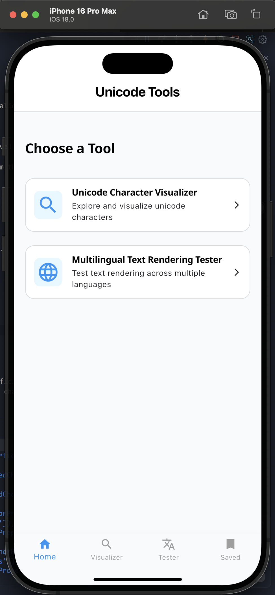

# Google Summer of Code 2025 Final Report

The goal of this project was to build two Flutter-based tools: a **Unicode Character Visualizer** and a **Multilingual Text Rendering Tester**. These tools make it easier for developers, designers, and linguists to explore Unicode characters, access detailed metadata, and compare multilingual text rendering across fonts and platforms. By improving accessibility, ensuring accurate character representation, and highlighting rendering inconsistencies, the project supports linguistic diversity and cross-platform compatibility.

---

## What I Did

- Developed a fully functional cross-platform application (Android and iOS) using the MVVM architecture, initially backed by mock data to validate design and feature set.
- Replaced the mock data layer with **ICU4X-powered data**.  
  * Originally, the plan was to use the Dart ICU4X bindings, but due to their unstable pre-release state, integration was not feasible.  
  * To resolve this, I used **FlutterRustBridge (FRB)** to bind Rust ICU4X functions directly into Flutter. Through this pipeline, I retrieved Unicode characters and their properties (e.g., via `CodePointInversionList::all()`).  
  * Since ICU4X currently lacks support for Unicode character names, I integrated the **unicode_names2::name** crate, which pulls names from the Unicode 16.0.0 NamesList.
- Designed and implemented a **font rendering pipeline**:  
  * A Dart resolver function returns fonts based on a given script.  
  * Script names were sourced from a Rust function (`getAllScripts`).  
  * Rendering primarily used Google Noto Fonts (per Unicode expert recommendations), with the system default font as fallback.
- Integrated the **Multilingual Tester**, which maps fonts from the Dart resolver to user input:  
  * A Rust function (`getScriptForChar`) detects the script of the first character.  
  * The app dynamically selects the appropriate font, ensuring correct typographic rendering and seamless fallback for mixed-script strings.
- Implemented a **comprehensive testing strategy**:  
  * Unit tests validated script detection, font mapping, and data retrieval.  
  * Widget tests verified UI behavior under multilingual input (e.g., font switching, fallback rendering).  
  * Edge cases tested included unsupported scripts, malformed input, and missing system fonts.

Click the image above to watch the demo video.

---

## Current State

- **Home Screen** – Entry point that presents both tools: the Unicode Character Visualizer and the Multilingual Text Rendering Tester.
- **Unicode Explorer Screen** – Lists all Unicode characters with names and code points. Includes a debounced (1000 ms) search field for efficient lookup.
- **Character Information Screen** – Shows details for a selected character (Name, Code Point, Block, Plane, Script, Category). Renders the character across Noto fonts and the system font. Includes a “Save” button to bookmark characters.
- **Saved Characters Screen** – Displays saved characters, with a fallback message (“No Saved Characters”) if empty.
- **Multilingual Tester** – Lets users input text and see it rendered in different font modes:  
  * **All** – all available fonts for the script.  
  * **Noto Fonts** – relevant Noto fonts only.  
  * **System Default** – system font rendering.

---

## What’s Left to Do

- **Web Support** – The app currently runs on Android and iOS. Adding web support is a priority, but there are limitations around the FFI bindings used. Finding a solution for this remains ongoing work.

---

## Challenges and Key Learnings

- **ICU4X Integration** – Dart bindings for ICU4X were unstable. To solve this, I learned Rust and used FlutterRustBridge to expose Rust functions to Dart, creating a stable integration pipeline.  
- **Cross-Script Rendering** – Managing multiple scripts and fonts required careful handling of fallback logic to ensure proper rendering across diverse languages.  
- **Testing Multilingual Scenarios** – Designing meaningful test cases for mixed-script inputs improved the app’s robustness and highlighted the complexity of global text rendering.

---

## Acknowledgements

I would like to thank my mentor Shane Carr and the ICU4X/Flutter communities for their support, feedback, and guidance throughout this project. Their insights were invaluable in overcoming challenges and delivering a functional, impactful tool.
